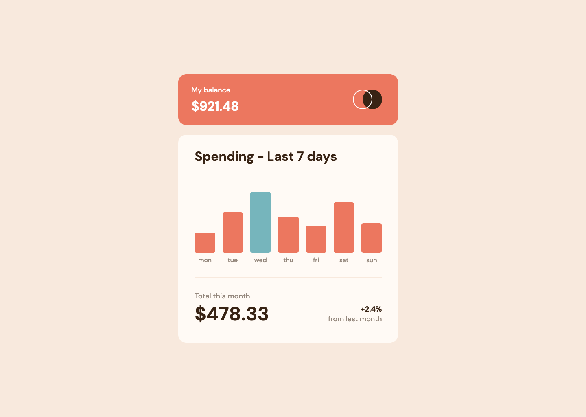

# Frontend Mentor - Expenses Chart Component Solution

This is a solution to the [Expenses Chart Component Challenge on Frontend Mentor](https://www.frontendmentor.io/challenges/expenses-chart-component-e7yJBUdjwt). Frontend Mentor challenges help you improve your coding skills by building realistic projects. 


## The challenge

Users should be able to:

- View the bar chart and hover over the individual bars to see the correct amounts for each day
- See the current day’s bar highlighted in a different colour to the other bars
- View the optimal layout for the content depending on their device’s screen size
- See hover states for all interactive elements on the page
- **Bonus**: Use the JSON data file provided to dynamically size the bars on the chart

## Screenshot

### Mobile


### Desktop



## Built with

- Semantic HTML5 markup
- CSS custom properties
- Flexbox
- CSS Grid
- Mobile-first workflow
- Vanilla JS

## What I learned

I used a media query to ensure that the daily amounts are displayed automatically for touch devices, as there would be no way for the person to hover over the bars on these devices:
```css
@media (hover: hover) {
    .spending__day-amount {
        visibility: hidden;
        transform: translateX(-50%) scale(0);
        transform-origin: bottom;
        opacity: 0;
        transition: transform var(--ad-sm) ease-out, opacity var(--ad-sm);
    }
}
```
This is the first time I have used this type of media query.

I used [Utopia](https://utopia.fyi/) to create fluid scaling of font sizes and spacing, therefore viewport media queries were not necessary in this project.

I added `tabindex=0` to the 'day' elements so that these can receive focus and the person can then view the amount for each day using their keyboard.

I completed the bonus challenge for this project - 'Use the JSON data file provided to dynamically size the bars on the chart'. This required a lot of JS to create the elements and implement the logic, but was probably my favourite part of the project. If you were to alter the amounts in the data file, a bar chart would still be generated with the correct heights, and the highest would be in the green color.

## Continued development

To be honest, I had been learning React but was making slow progress so decided to tackle this fun project to give myself a break from React. Life has been a bit busy but I will try to make more time for coding and push myself to learn new things.